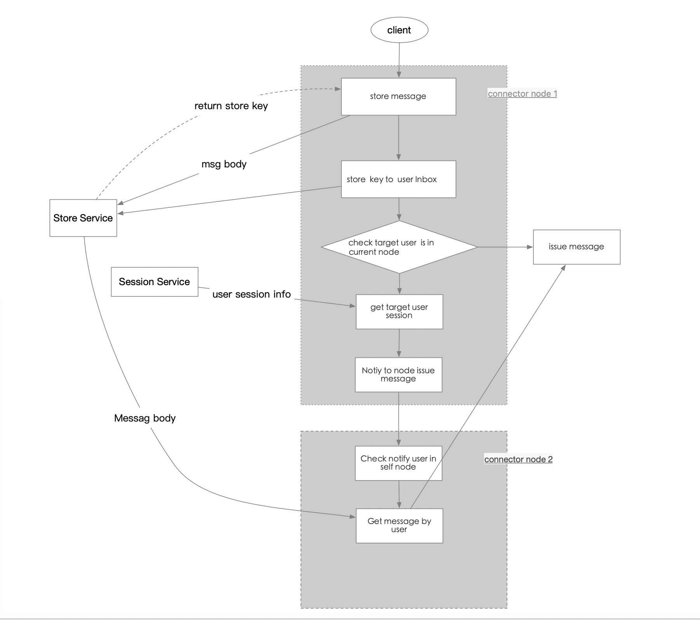
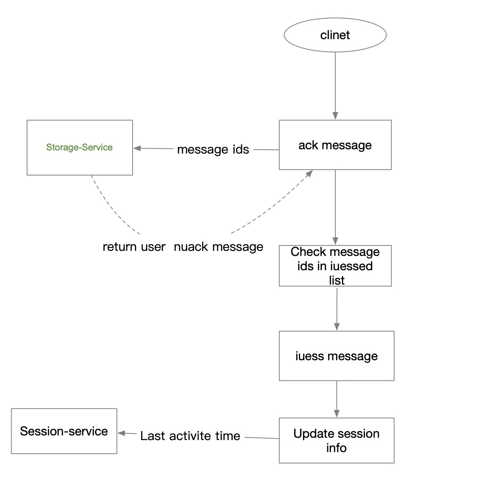
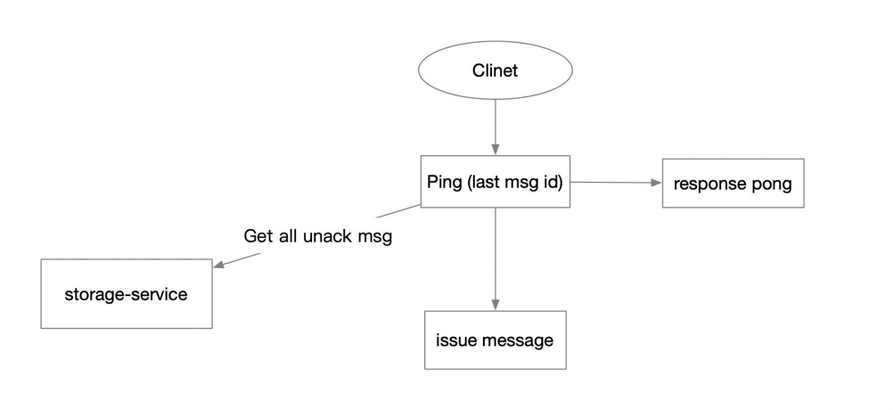

# kitten-im

### Service invoking architecture

### Message Sender Flow

### Messge Ack flow

### Ping flow

### connert rpc

 1. grpc
 
 
 ### deploy resource
 Index	Size	quantity	Service
 1	4Core  8G	6	connector-gateway,business-gateway(1/2)
 2	4Core  16G	3	store-service(tikv)
 3	4Core  8G	3	session-service(redis)
 4	4Core  8G	3	register-service(Raft in memory)
